# Flow: Period and Cycle Tracking Web Application

## DBMS Assignment Project Report

> **Course:** Semester 4 DBMS Assignment  
> **Application:** Flow — Period Tracker  
> **Database target:** Oracle Autonomous Database  
> **Prepared:** September 2026  
> **Student:** Kritika Subedi  
> **Student ID:** LC00014001893
> **Institution:** CSIT, KFA

<!--
When this Markdown file is exported to PDF, add a page break after the cover,
generate a table of contents, and enable page numbering in the export tool.
Screenshots are included from the `docs/` folder.
-->

## Table of Contents

1. [Project Proposal](#1-project-proposal)
2. [Project Objectives and Scope](#2-project-objectives-and-scope)
3. [Current Features](#3-current-features)
4. [Requirement Coverage](#4-requirement-coverage)
5. [Application and Web Component Design](#5-application-and-web-component-design)
6. [Navigation Design](#6-navigation-design)
7. [System Architecture](#7-system-architecture)
8. [Business Layer Design](#8-business-layer-design)
9. [ORM Data Layer Design](#9-orm-data-layer-design)
10. [Database Design and ERD](#10-database-design-and-erd)
11. [CRUD and API Design](#11-crud-and-api-design)
12. [Related and Complex Queries](#12-related-and-complex-queries)
13. [User Manual](#13-user-manual)
14. [Installation Manual](#14-installation-manual)
15. [Development Process and Testing](#15-development-process-and-testing)
16. [Screenshots](#16-screenshots)
17. [Limitations and Future Work](#17-limitations-and-future-work)
18. [Conclusion](#18-conclusion)

## 1. Project Proposal

Flow is a web-based application for tracking periods and cycles. It lets a
user securely record period dates, symptoms, moods, and daily health
measurements in one place, then uses that data to calculate cycle statistics,
predict the next period, mark days on the calendar, and offer simple insights.

This project was chosen because period tracking naturally involves related
data: a user has one settings record, but many periods, many symptoms, many
moods, and many daily logs. That relationship between one user and several
connected tables makes it a good fit for demonstrating relational database
design — foreign keys, CRUD operations, ORM models, joins, aggregate queries,
and a web-based interface.

The database is built for Oracle Autonomous Database. The backend uses
Flask-SQLAlchemy and the `python-oracledb` driver for ORM-based persistence,
CRUD operations, joins, aggregates, and report queries.

## 2. Project Objectives and Scope

### 2.1 Objectives

- Give users a simple, responsive web interface for daily tracking.
- Store user and tracking data in a normalized relational schema.
- Protect each user's records with JWT authentication and access limited to
  their own data.
- Show ORM model classes that match the Oracle database tables.
- Demonstrate CRUD operations and multi-table queries, as required by the
  DBMS assignment.
- Calculate useful cycle statistics while keeping business rules out of the
  database layer.
- Provide clear documentation for installation, testing, and the database
  design.

### 2.2 Scope

The current scope covers account management, cycle settings, period logging,
symptom logging, mood logging, daily measurements, calendar classification,
history, insights, report queries, and JSON export.

Flow is meant as a wellness and record-keeping tool only — it is not a
medical device, a form of contraception, a diagnostic service, or a
substitute for professional medical advice.

## 3. Current Features

### 3.1 Authentication and account management

- Email and password registration and login.
- Passwords are hashed with bcrypt; nothing is ever stored as plain text.
- JWT-based authentication with a configurable expiry time.
- View and update the logged-in user's email and name.
- Delete the current account along with all related records.
- Every tracking query is limited to the authenticated user's own ID.

### 3.2 Period tracking

- Record the period's start date, end date, flow level, and notes.
- View, edit, and delete period records.
- Work out completed cycle lengths from consecutive period start dates.
- Predict future period dates based on recorded history and configured
  defaults.

### 3.3 Symptom, mood, and daily tracking

- Record symptoms along with severity and notes.
- Record moods along with an energy level.
- Record daily weight, temperature, discharge, intercourse, medication,
  cramps, and notes.
- View, edit, and delete all three types of log entries.

### 3.4 Calendar and insights

- Calendar view showing logged periods.
- Predicted future periods, fertile window, and ovulation days.
- Dashboard statistics, such as average cycle length and current phase.
- Most common symptoms and their average severity.
- Mood distribution and a count of what's been logged today.
- An insights screen that turns joined report data into easy-to-read cycle
  patterns, recurring symptoms, mood patterns, and body/mood check-ins.

### 3.5 Frontend usability

- A React single-page application built with Vite.
- Responsive navigation across the dashboard, calendar, log, history,
  insights, and settings screens.
- Loading skeletons, error messages, confirmation prompts, and toast
  notifications.
- Search and filtering in the history screen.
- JSON data export from within the app.

## 4. Requirement Coverage

| Assignment requirement                                    | Current status                           | Evidence in the project                                                                              |
| --------------------------------------------------------- | ---------------------------------------- | ---------------------------------------------------------------------------------------------------- |
| Python web application                                    | Implemented                              | Flask backend in `backend/main.py`                                                                   |
| Oracle database                                           | Implemented for production configuration | `database_oracle.py`, `python-oracledb`, Oracle SQL script                                           |
| Three or more linked tables                               | Implemented                              | Six tables linked through `user_id` foreign keys                                                     |
| ORM model classes                                         | Implemented for Oracle                   | Flask-SQLAlchemy models: `User`, `Settings`, `Period`, `Symptom`, `Mood`, `DailyLog`                 |
| DTOs/API serializers                                      | Implemented                              | Pydantic request and response models in `main.py`                                                    |
| Business service layer                                    | Partially implemented                    | Cycle business rules are isolated in `cycle.py`; a separate `services/` package could be added later |
| CRUD for each table                                       | Implemented                              | Account/settings endpoints and full log CRUD endpoints                                               |
| Three related-entity queries                              | Implemented                              | `GET /api/reports` returns three related query result sets                                           |
| Two complex queries using at least three related entities | Implemented                              | `GET /api/reports` returns two aggregate result sets                                                 |
| Web GUI                                                   | Implemented                              | React/Vite frontend in `frontend/src`                                                                |
| Oracle SQL scripts                                        | Implemented                              | `sql/oracle_schema.sql`                                                                              |
| Project report and design document                        | This document                            | `Report.md`                                                                                          |
| Demonstration                                             | Pending presentation                     | Demonstrate the running application and report queries                                               |
| Testing and clean-environment process                     | Implemented                              | Automated backend tests, Python compilation, frontend lint/build                                     |

## 5. Application and Web Component Design

### 5.1 Frontend components

| Component/page          | Responsibility                                                     |
| ----------------------- | ------------------------------------------------------------------ |
| `Auth`                  | Login and registration forms                                       |
| `Dashboard`             | Current cycle overview, phase, predictions, and daily summary      |
| `CalendarPage`          | Month calendar and day classification                              |
| `LogPage`               | Forms for period, symptom, mood, and daily entries                 |
| `HistoryPage`           | Search, edit, and delete previously saved entries                  |
| `Insights`              | Charts, statistics, and plain-language personal patterns           |
| `Settings`              | Cycle settings, profile editing, account deletion, and preferences |
| `Sidebar` / `BottomNav` | Desktop/mobile navigation                                          |
| `api.js`                | Centralized HTTP calls and JWT header handling                     |
| `Toast` / `Skeletons`   | Feedback and loading states                                        |

Session state and shared data both live in `App.jsx`. Pages call the API
module and refresh the shared data whenever something changes, which keeps
the app simple without needing a separate global state library.

### 5.2 Backend components

| Component               | Responsibility                                                                    |
| ----------------------- | --------------------------------------------------------------------------------- |
| `main.py`               | Flask application, routes, validation, DTO serialization, static frontend serving |
| `auth.py`               | Password hashing, password verification, JWT creation, current-user extraction    |
| `cycle.py`              | Pure cycle statistics, prediction, fertile-window, phase, and calendar logic      |
| `database.py`           | Database entry point for the Oracle data-access implementation                    |
| `database_oracle.py`    | Oracle ORM models, SQLAlchemy session, CRUD, aggregates, and joins                |
| `sql/oracle_schema.sql` | Oracle DDL script                                                                 |

### 5.3 Validation and serialization

Pydantic input models check dates, numeric ranges, required fields, and
optional fields before anything touches the database. Response DTOs keep the
API contract explicit, while still using the JSON field names the React
client already expects. Oracle dates and numeric values are normalized
before they're serialized to JSON.

## 6. Navigation Design

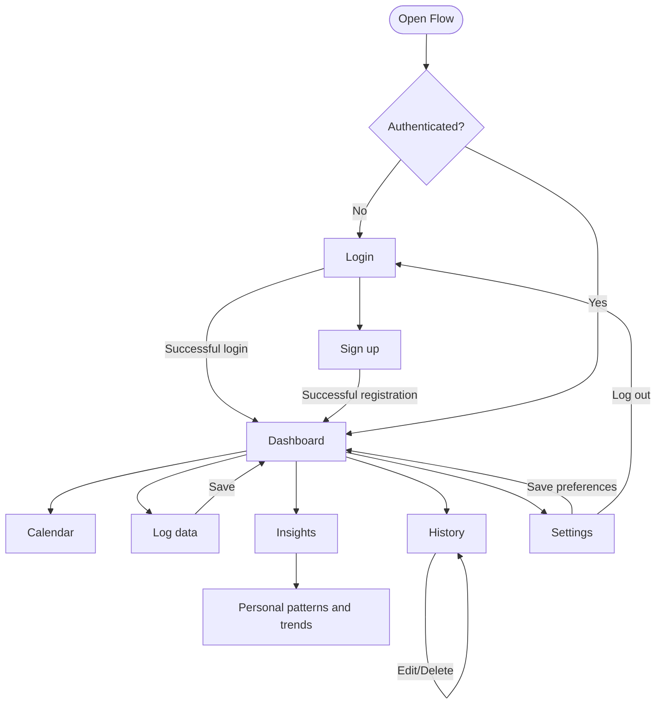

## 7. System Architecture

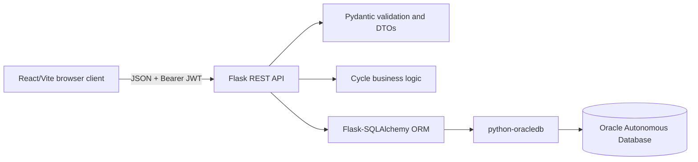

### 7.1 Request lifecycle

1. The React client sends a request through `frontend/src/api.js`.
2. The API wrapper attaches the JWT bearer token if a session exists.
3. Flask matches the route, and Pydantic validates the request JSON.
4. `auth.py` reads the authenticated user's ID from the JWT.
5. The route calls the Oracle data-access method for the authenticated user.
6. `database.py` exposes the Oracle ORM implementation to the application.
7. The route applies cycle logic or DTO serialization where needed.
8. Flask sends the JSON response back to the frontend.

## 8. Business Layer Design

The business layer is kept small and easy to read on purpose. The core
business rules live as plain Python functions in `backend/cycle.py`, so they
don't depend on a database connection, a Flask request, or any frontend state.

### 8.1 Cycle calculations

- Completed cycle length is the number of days between two consecutive period
  start dates.
- Only gaps between 15 and 60 days are counted as physiologically plausible
  cycles.
- If there isn't enough history yet, the configured settings act as fallback
  values.
- The predicted next period is the latest period start date plus the average
  cycle length.
- Ovulation is estimated by subtracting the configured luteal phase length
  from the predicted next period.
- The fertile window is worked out from that estimated ovulation date.
- Each calendar day is marked as a logged period, a predicted period,
  fertile, ovulation, or a plain day.

### 8.2 Separation of responsibilities

- Flask routes handle HTTP requests and responses.
- Pydantic models validate the input and response data.
- `cycle.py` handles the domain calculations.
- The Oracle data-access module handles storage and database queries.
- The frontend displays data and sends user actions, but never calculates
  values or writes to the database directly.

Right now, `cycle.py` together with route-level coordination already gives a
clear business layer. If the assignment calls for a visibly separate service
package, the lowest-risk next step would be to move that route-level
coordination into `backend/services/`, without changing the API or the
database schema.

## 9. ORM Data Layer Design

### 9.1 Oracle ORM implementation

`backend/database_oracle.py` sets up a Flask-SQLAlchemy extension and defines
one ORM model per Oracle table. The Oracle SQLAlchemy URL uses the
`oracle+oracledb` dialect, which connects through the `python-oracledb`
driver. The module also supports an Oracle DSN, host/port/service
configuration, and optional wallet settings.

Writes to Oracle go through a small transaction context manager: a
successful operation is committed, and an exception rolls the session back.
Reads use SQLAlchemy `select()` expressions. So in the Oracle backend, CRUD
operations, aggregate queries, joins, and report queries are all written as
ORM operations rather than handwritten driver cursor code.

### 9.2 ORM class mapping

| ORM class  | Table        | Primary key | Important relationships                     |
| ---------- | ------------ | ----------- | ------------------------------------------- |
| `User`     | `users`      | `id`        | Parent of all user-owned records            |
| `Settings` | `settings`   | `user_id`   | One settings row per user; FK to `users.id` |
| `Period`   | `periods`    | `id`        | Many periods per user; FK to `users.id`     |
| `Symptom`  | `symptoms`   | `id`        | Many symptoms per user; FK to `users.id`    |
| `Mood`     | `moods`      | `id`        | Many moods per user; FK to `users.id`       |
| `DailyLog` | `daily_logs` | `id`        | Many daily logs per user; FK to `users.id`  |

### 9.3 Class diagram

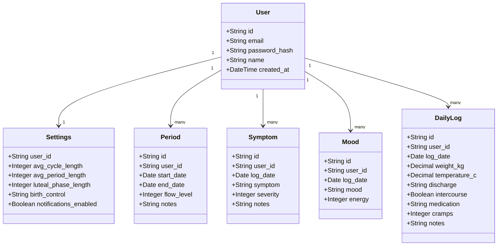

## 10. Database Design and ERD

### 10.1 Table descriptions

#### `users`

Stores each authenticated account. `email` must be unique, `password_hash`
holds the bcrypt password hash, and `id` is a 32-character identifier
generated in Python.

#### `settings`

Stores the user's configured average cycle length, average period length,
luteal phase length, birth-control value, and notification preference. Its
`user_id` primary key is also a foreign key, which gives a one-to-one
relationship with `users`.

#### `periods`

Stores each period's start date, end date, flow level, and notes. A user can
have many period rows, and a period is left open-ended by leaving `end_date`
null.

#### `symptoms`

Stores a symptom name, date, a severity score from 1 to 5, and optional
notes. Each row belongs to a single user.

#### `moods`

Stores a mood label, date, and an energy value from 1 to 5. Each row belongs
to a single user.

#### `daily_logs`

Stores daily physical measurements and observations: weight, temperature,
discharge, an intercourse flag, medication, cramps, and notes.

### 10.2 Relational ERD

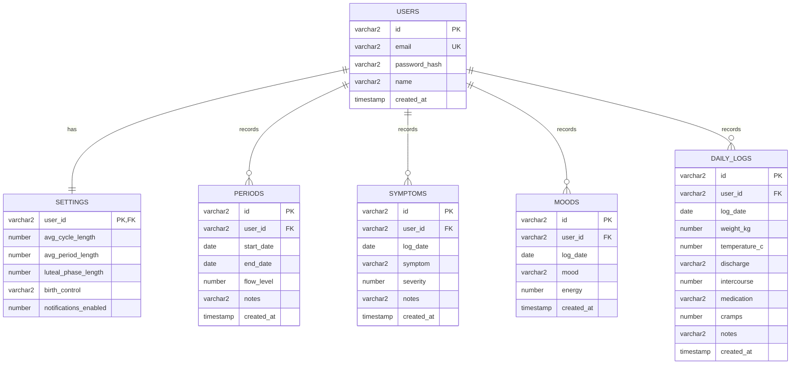

### 10.3 Constraints and indexes

- Primary keys identify every record and stop duplicate IDs from appearing.
- `users.email` carries a unique constraint.
- Child records reference `users.id` through foreign keys.
- Fields that matter — email, password hash, user ID, dates, symptom name,
  mood name — are set to non-null where it makes sense.
- `ix_periods_user_start` speeds up a user's period history when ordered by
  start date.
- `ix_symptoms_user_date`, `ix_moods_user_date`, and
  `ix_daily_logs_user_date` speed up user/date history lookups and report
  joins.

The authoritative Oracle DDL lives in `sql/oracle_schema.sql`. SQLAlchemy
metadata safely creates any missing Oracle tables and indexes when the
application starts.

## 11. CRUD and API Design

| Resource  | Create                     | Read                | Update                   | Delete                      |
| --------- | -------------------------- | ------------------- | ------------------------ | --------------------------- |
| User      | `POST /api/auth/signup`    | `GET /api/me`       | `PUT /api/me`            | `DELETE /api/me`            |
| Settings  | `PUT /api/settings` upsert | `GET /api/settings` | `PUT /api/settings`      | `DELETE /api/settings`      |
| Period    | `POST /api/periods`        | `GET /api/periods`  | `PUT /api/periods/<id>`  | `DELETE /api/periods/<id>`  |
| Symptom   | `POST /api/symptoms`       | `GET /api/symptoms` | `PUT /api/symptoms/<id>` | `DELETE /api/symptoms/<id>` |
| Mood      | `POST /api/moods`          | `GET /api/moods`    | `PUT /api/moods/<id>`    | `DELETE /api/moods/<id>`    |
| Daily log | `POST /api/daily`          | `GET /api/daily`    | `PUT /api/daily/<id>`    | `DELETE /api/daily/<id>`    |

Every authenticated endpoint pulls the user ID out of the JWT and passes it
into the data-access method. Update and delete operations also check
ownership, so a user can't guess an ID and edit someone else's records.

## 12. Related and Complex Queries

The `GET /api/reports` endpoint is an internal data endpoint that powers the
Insights screen. The technical query names are never shown to end users —
instead, the frontend turns the returned data into plain-language patterns
that help a user make sense of their own tracking history.

| Query result                   | How it is used in the application                                   | User-facing location               |
| ------------------------------ | ------------------------------------------------------------------- | ---------------------------------- |
| User settings and periods      | Provides the user's typical cycle and period context                | **Insights → Your cycle patterns** |
| Periods and symptoms           | Shows symptom count and average severity for the latest period      | **Insights → Your cycle patterns** |
| Daily measurements and moods   | Provides the latest mood/body check-in                              | **Insights → Patterns to notice**  |
| Symptoms within period spans   | Identifies the symptom recurring most often across periods          | **Insights → Patterns to notice**  |
| Mood and physical measurements | Identifies the most energising mood and its associated measurements | **Insights → Patterns to notice**  |

### 12.1 Related query 1: user settings and periods

Joins `users`, `settings`, and `periods` to show a user's cycle settings next
to their period history. This is a three-table relationship that uses a left
join, so the user/settings row is still returned even when there are no
period records yet. In the app, this result fills in the **Typical cycle**
and **Typical period** values on the **Your cycle patterns** card.

### 12.2 Related query 2: periods and symptoms

Joins `users`, `periods`, and `symptoms`. Symptoms are matched to each
period's start date and grouped to show the symptom count and average
severity per period. In the app, the most recent result fills in the
**Latest period symptoms** count and severity note on the **Your cycle
patterns** card.

### 12.3 Related query 3: daily measurements and moods

Joins `users`, `daily_logs`, and `moods` on user and date, comparing weight
and temperature measurements with the mood and energy logged on that same
day. In the app, the most recent result fills in the **Latest mood
check-in** value on the **Patterns to notice** card.

### 12.4 Complex query 1: symptoms within period spans

Joins `users`, `periods`, and `symptoms`, filters the symptoms down to each
period's date range, and works out symptom frequency, average severity, and
how many periods each symptom showed up in. In the app, this powers the
**Most recurring symptom** insight and explains how often it appeared.

### 12.5 Complex query 2: mood and physical measurements

Joins `users`, `moods`, and `daily_logs`, groups everything by mood, and
calculates mood count, average energy, average temperature, and average
weight. In the app, this identifies the **Most energising mood** and feeds
into the user's mood/body pattern summary.

All five result sets are built in `database_oracle.py` using
Flask-SQLAlchemy `select`, join, grouping, aggregate, and ordering
expressions.

## 13. User Manual

### 13.1 Create an account

1. Open the application.
2. Select **Sign up**.
3. Enter an email address, a password with at least six characters, and an
   optional name.
4. Submit the form — a session is created once registration succeeds.

### 13.2 Log a period

1. Open **Log**.
2. Select the period entry form.
3. Enter the start date, an optional end date, the flow level, and any notes.
4. Save the entry.
5. The dashboard, calendar, history, and predictions all refresh
   automatically.

### 13.3 Log symptoms, moods, and daily data

Use the matching form on the **Log** screen. Dates, severity/energy ranges,
and numeric values are all validated before the entry is saved.

### 13.4 Edit or delete records

1. Open **History**.
2. Search by date or content if needed.
3. Select the edit icon to update a record.
4. Select delete, then confirm, to remove a record.

### 13.5 View insights

**Dashboard** shows the current cycle information. **Calendar** shows logged
and predicted days. **Insights** shows charts, summaries, and easy-to-read
patterns pulled from the user's joined tracking data.

### 13.6 Update settings or profile

Open **Settings** to change cycle defaults, luteal phase length,
notifications, birth-control information, name, or email. Account deletion
is also on this screen and requires confirmation.

## 14. Installation Manual

### 14.1 Requirements

- Python 3.12 or newer.
- Node.js and npm, or Yarn.
- Oracle Autonomous Database for production mode.
- An Oracle wallet when the selected Autonomous Database connection requires
  mTLS.

### 14.2 Oracle setup

```bash
cd flow
python3 -m venv .venv
source .venv/bin/activate
python -m pip install -r backend/requirements.txt
cd frontend
npm install
npm run build
cd ..
```

1. Provision an Oracle Autonomous Database.
2. Download the wallet, if the database uses mTLS.
3. Install the Python dependencies from `backend/requirements.txt`.
4. Set the Oracle environment variables:

```bash
export DB_MODE=oracle
export ORACLE_DB_USER=admin
export ORACLE_DB_PASSWORD='your-password'
export ORACLE_DB_DSN='host:1522/service_name'
export ORACLE_DB_WALLET_DIR='/path/to/wallet'       # if required
export ORACLE_DB_WALLET_PASSWORD='wallet-password'  # if required
export JWT_SECRET='replace-with-a-long-random-secret'
```

5. Start the Flask app:

```bash
python -m flask --app backend.main run --debug --host 0.0.0.0 --port 8000
```

6. On startup, Flask-SQLAlchemy connects through `python-oracledb` and
   creates any missing ORM tables and indexes.

For manual Oracle setup, or for submission, run `sql/oracle_schema.sql` in
Oracle SQL Developer before starting the application. Never commit
passwords, wallet files, or `.env` files.

### 14.3 Clean-environment procedure

1. Clone or extract the complete project.
2. Create a fresh Python virtual environment.
3. Install from `backend/requirements.txt`.
4. Install frontend dependencies and build the frontend.
5. Configure the Oracle connection using environment variables.
6. Start the server and run the automated tests.

## 15. Development Process and Testing

### 15.1 Development approach

The project was developed incrementally:

1. Define the relational schema and user-scoped ownership model.
2. Implement authentication and basic logging endpoints.
3. Add frontend forms, history, calendar, and insights screens.
4. Add full CRUD and explicit response DTOs.
5. Add related and complex report queries.
6. Integrate Flask-SQLAlchemy and `python-oracledb` for Oracle.
7. Run regression tests and frontend build checks after database changes.

### 15.2 Automated tests

The backend regression suite runs on Python's built-in `unittest` framework
against an isolated test database. It checks:

- That all six tables get created correctly from `sql/oracle_schema.sql`.
- Create, read, update, and delete operations for periods, symptoms, moods,
  and daily logs.
- Profile and settings updates.
- The three related and two complex report result groups.
- Account deletion, including all dependent records.

Run the tests with:

```bash
./.venv/bin/python -m unittest discover -s backend/tests -v
```

Additional checks used during development:

```bash
./.venv/bin/python -m py_compile backend/*.py backend/tests/*.py
cd frontend && npm run lint && npm run build
```

Right now, the regression run passes all four backend tests, and the
frontend lint and production build both pass too. A live Oracle connection
still needs to be tested separately, with valid Oracle credentials and an
available database instance.

## 16. Screenshots

Screenshots of the current application are stored in the `docs/` folder and
included below as evidence of the implemented web interface.

### 16.1 Login screen

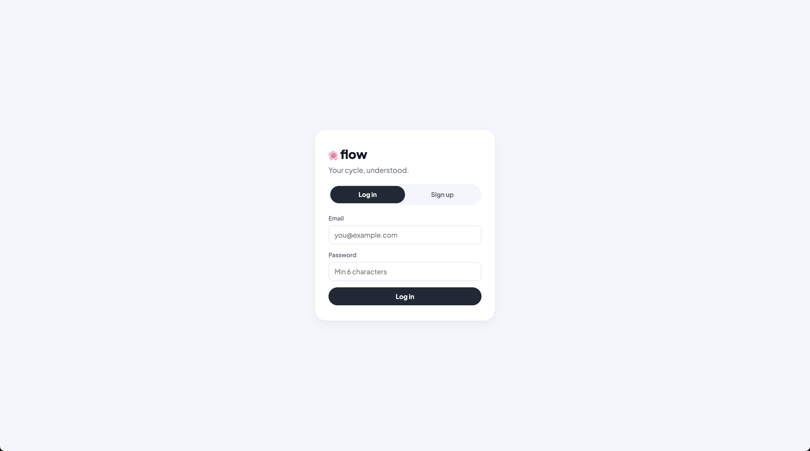

_Shows the login form and application branding._

### 16.2 Registration screen

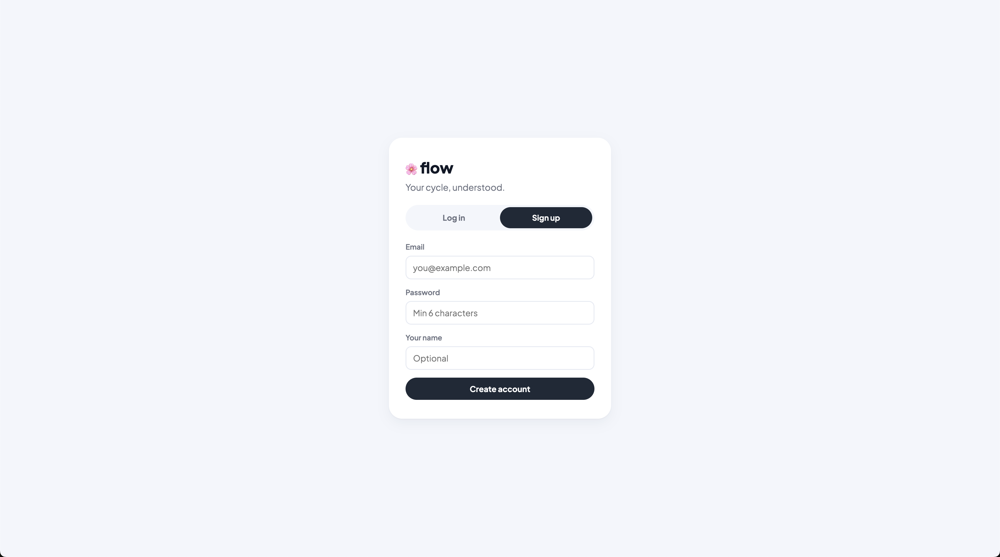

_Shows account creation validation and fields._

### 16.3 Dashboard

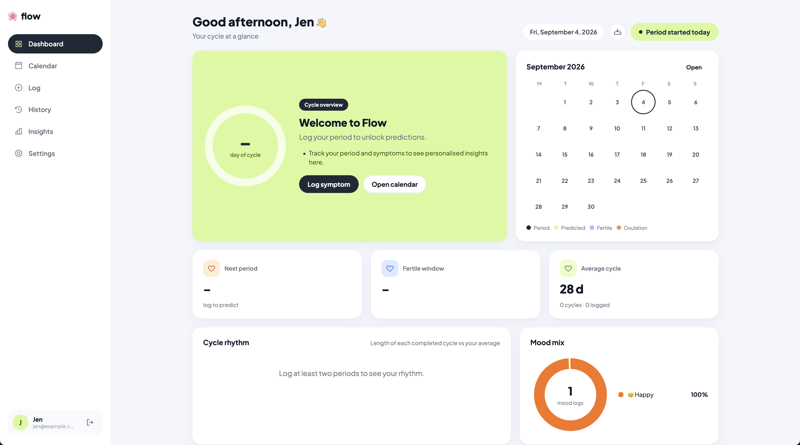

_Shows current cycle phase, prediction, statistics, and daily summary._

### 16.4 Calendar

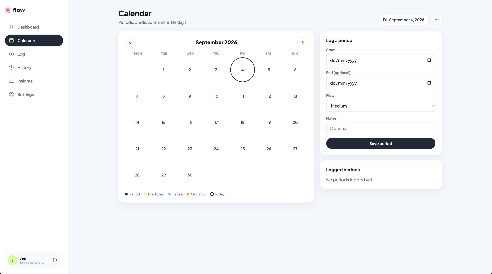

_Shows logged periods, predicted periods, fertile days, and ovulation._

### 16.5 Logging screen

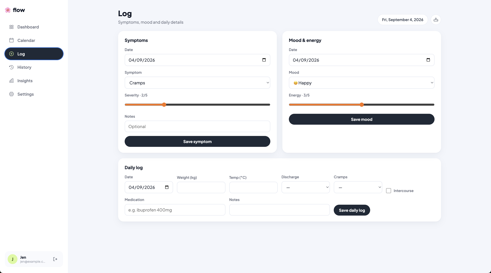

_Shows period, symptom, mood, and daily-log entry forms._

### 16.6 History screen

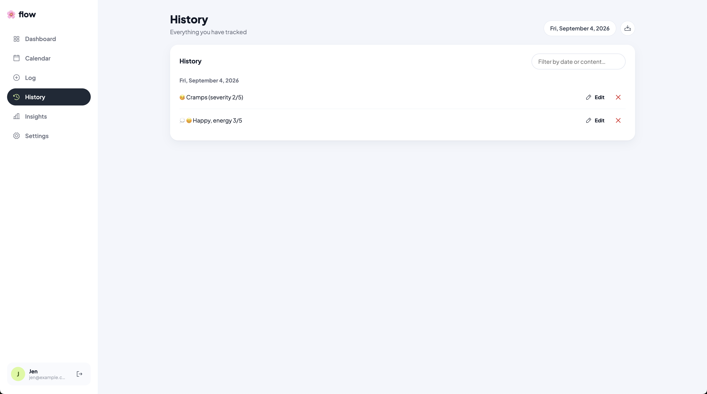

_Shows grouped records, search, edit, and delete controls._

### 16.7 Insights and report queries

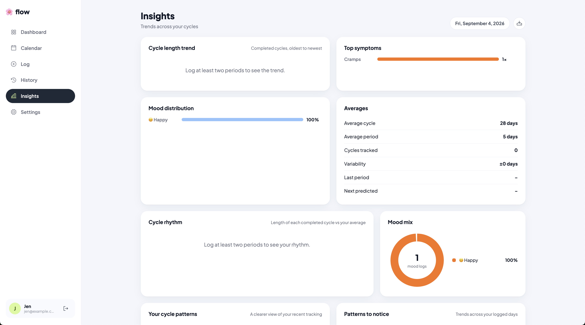

_Shows charts, statistics, and user-facing personal patterns._

### 16.8 Settings screen

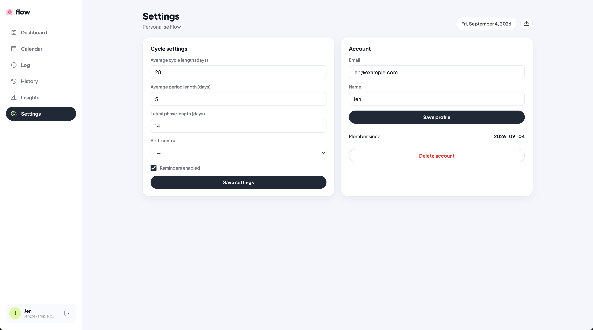

_Shows cycle settings, profile editing, notifications, and account actions._

## 17. Conclusion

Flow is a working relational web application built around six linked Oracle
tables, complete CRUD for all tracking data, a React GUI, Pydantic DTOs,
business calculations, ORM model classes, and multi-table report queries.

The application runs on Flask-SQLAlchemy and `python-oracledb`. At this point,
it is ready for screenshots, a live demo, and final report formatting.
